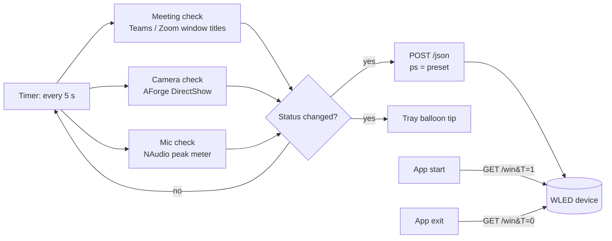

# OnAir

**OnAir** (tray name: *OnAir Monitor*) is a lightweight Windows system tray application that
lights up an "On Air" sign when you are in a meeting. It watches for active Microsoft Teams
and Zoom meetings and for camera use, and drives a [WLED](https://github.com/Aircoookie/WLED)
device (an ESP32/ESP8266 LED controller) over HTTP. Each combination of *meeting / no meeting*
and *camera / no camera* maps to a WLED preset, so the sign can show a different color or
effect for each state.

It is written in C# for .NET Framework 4.8 (WinForms) and runs hidden in the notification
area.

## Table of contents

- [Features](#features)
- [How it works](#how-it-works)
- [Requirements](#requirements)
- [Installation](#installation)
- [Configuration](#configuration)
- [WLED / ESP32 setup](#wled--esp32-setup)
- [Usage](#usage)
- [Start the application with Windows](#start-the-application-with-windows)
- [Troubleshooting](#troubleshooting)
- [Known issues and limitations](#known-issues-and-limitations)
- [Security notes](#security-notes)
- [Development](#development)
- [Contributing](#contributing)
- [License](#license)

## Features

- **Active meeting detection:** finds running `Teams` and `Zoom` processes and checks whether
  their main window title contains `Meeting` or `Call`.
- **Camera monitoring:** checks whether a specific camera (selected by its hardware ID) is
  busy, using AForge.NET DirectShow.
- **Microphone monitoring:** samples the peak level of the default recording device with
  NAudio and reports it in the status notification.
- **WLED presets:** sends a JSON `{"ps": <preset>}` POST to WLED whenever the detected status
  changes. Four configurable presets cover the four meeting/camera combinations.
- **Sign on/off:** turns the WLED device on when the app starts and off when it exits.
- **System tray integration:** runs in the background with a tray icon, a context menu
  (Start Monitoring / Stop Monitoring / Exit), and balloon notifications on every status
  change or HTTP error.

## How it works



### Polling

A WinForms timer runs the status check every **5 seconds** (hard-coded). Double-clicking the
tray icon runs the check immediately.

### Meeting detection

`MeetingHelper` looks up processes named `Teams` and `Zoom` (`Process.GetProcessesByName`).
For each process with a main window, it treats the app as "in a meeting" when the window
title contains `Meeting` or `Call` (case-insensitive). The names of the matching apps (for
example `Teams, Zoom`) appear in the status notification.

### Camera detection

`CameraHelper` lists DirectShow video input devices and picks the first one whose moniker
string contains the configured `CameraHardwareId` (case-insensitive). It then tries to start
that camera and waits up to 2 seconds for a frame:

| Result of the probe | Treated as |
|---|---|
| A frame arrives within 2 s | Camera **free** |
| No frame within 2 s | Camera **in use** |
| Starting the camera throws an exception | Camera **in use** |
| No device matches `CameraHardwareId` | Camera **in use** |

### Microphone detection

`AudioHelper` reads `MasterPeakValue` of the default capture device (console role) every
100 ms for up to 2 seconds. A peak above `0.01` counts as "microphone in use". Errors count
as "not in use". The microphone state appears in the balloon notification and triggers a
status change, but it does **not** affect which preset is sent.

### Preset selection

| Meeting active | Camera in use | Setting used | Built-in fallback |
|---|---|---|
| Yes | Yes | `ActiveMeetingWithCameraPreset` | `1` |
| Yes | No | `ActiveMeetingWithoutCameraPreset` | `2` |
| No | Yes | `NoMeetingWithCameraPreset` | `5` |
| No | No | `NoMeetingWithoutCameraPreset` | `3` |

### HTTP requests sent to WLED

| When | Request | Effect on WLED |
|---|---|---|
| App starts (form load) | `GET {GetUrl}&T=1`, e.g. `http://<wled-ip>/win&T=1` | Turns the LEDs on |
| Status changes (and on the first check) | `POST {PostUrl}` with body `{ "ps": <preset> }` and `Content-Type: application/json` | Applies the preset |
| App exits (tray **Exit** or window closing) | `GET {GetUrl}&T=0`, e.g. `http://<wled-ip>/win&T=0` | Turns the LEDs off |

A "status change" means any difference in meeting state, the list of meeting apps, camera
state, microphone state or preset. Responses are not checked; only connection errors are
reported, as a balloon tip.

## Requirements

- **Windows** (desktop, with a notification area).
- **.NET Framework 4.8** runtime.
- Microsoft **Teams** and/or **Zoom** desktop clients (the only apps detected).
- A webcam, if you want camera-based presets.
- A **WLED device**: an ESP32 or ESP8266 flashed with the
  [WLED firmware](https://github.com/Aircoookie/WLED), reachable over HTTP from the PC, with the
  presets you want to use already saved.
- No administrator rights are needed. The app has no elevation manifest and writes nothing to
  the registry or disk.

NuGet dependencies (restored automatically when building from source; shipped as DLLs in the
zip): AForge 2.2.5, AForge.Video 2.2.5, AForge.Video.DirectShow 2.2.5, NAudio 2.2.1 (and its
sub-packages), Microsoft.Win32.Registry 4.7.0, System.Security.AccessControl 4.7.0 and
System.Security.Principal.Windows 4.7.0.

## Installation

There are no GitHub Releases. Use the prebuilt zip in the repository, or build from source.

### Option 1: prebuilt zip

1. Set up WLED on your ESP32/ESP8266 (see [WLED / ESP32 setup](#wled--esp32-setup)):

   https://github.com/user-attachments/assets/0967acd1-1a92-423c-a835-a51deebda3a0

2. Download [OnAir.zip](https://github.com/t0mer/OnAir/raw/refs/heads/main/OnAir.zip). It
   contains a single `OnAir/` folder with `OnAir.exe`, `OnAir.exe.config` and the dependency
   DLLs.
3. Extract the zip to a folder of your choice.
4. Edit `OnAir.exe.config` (see [Configuration](#configuration)). **Fill in every value**:
   the shipped file has empty preset values, and the app will not start with them.
5. Run `OnAir.exe`. The tray icon appears and the WLED device turns on.

The `OnAir.exe` in the zip was likely built from the current source: its strings match the
code, and it is dated the same day as the source commit.
<!-- TODO: verify the zip exe byte-for-byte against a fresh Release build. -->

### Option 2: build from source

1. Install Visual Studio (with the *.NET desktop development* workload) or the Build Tools
   with the .NET Framework 4.8 targeting pack.
2. Clone the repository and open `OnAir/OnAir.sln`.
3. The NuGet packages are committed under `OnAir/packages/`, so no restore is needed.
4. Build the `Release` configuration, in Visual Studio or with MSBuild:

   ```powershell
   msbuild OnAir\OnAir.sln /p:Configuration=Release
   ```

5. The output is in `OnAir\OnAir\bin\Release\`. Edit `OnAir.exe.config` there (it is generated
   from `App.config`) and run `OnAir.exe`.

## Configuration

All settings live in the `<appSettings>` section of `OnAir.exe.config` (the `App.config` file in
the source tree), next to the executable. There is no settings UI. Edit the file and restart the
app for changes to apply. `Properties/Settings.settings` is empty and not used.

The shipped configs are **not filled in**. The source `App.config` has `http://[]/…` URLs and
empty presets. The zip's `OnAir.exe.config` has `[WLED_IP]` URLs, empty presets and an empty
`CameraHardwareId`. Replace all of them.

Example (filled in):

```xml
<?xml version="1.0" encoding="utf-8" ?>
<configuration>
    <startup>
        <supportedRuntime version="v4.0" sku=".NETFramework,Version=v4.8" />
    </startup>
	<appSettings>
		<!-- Camera and URLs -->
		<add key="CameraHardwareId" value="VID_xxxx&amp;PID_yyyy" />
		<add key="PostUrl" value="http://192.0.2.10/json" />
		<add key="GetUrl" value="http://192.0.2.10/win" />
		<!-- Preset values -->
		<add key="ActiveMeetingWithCameraPreset" value="1" />
		<add key="ActiveMeetingWithoutCameraPreset" value="2" />
		<add key="NoMeetingWithCameraPreset" value="5" />
		<add key="NoMeetingWithoutCameraPreset" value="3" />
	</appSettings>
</configuration>
```

| Key | Description | Built-in fallback (key missing) |
|---|---|---|
| `CameraHardwareId` | Part of the camera's hardware ID (`VID_xxxx&PID_yyyy`) used to find the camera. Write `&` as `&amp;` in the XML file. | A hard-coded hardware ID |
| `PostUrl` | WLED JSON API endpoint that receives the preset POST, e.g. `http://<wled-ip>/json`. | A hard-coded private LAN address |
| `GetUrl` | WLED HTTP API endpoint for on/off, e.g. `http://<wled-ip>/win`. `&T=1` / `&T=0` is appended. | A hard-coded private LAN address |
| `ActiveMeetingWithCameraPreset` | WLED preset ID for "in a meeting, camera on". | `1` |
| `ActiveMeetingWithoutCameraPreset` | WLED preset ID for "in a meeting, camera off". | `2` |
| `NoMeetingWithCameraPreset` | WLED preset ID for "no meeting, camera on". | `5` |
| `NoMeetingWithoutCameraPreset` | WLED preset ID for "no meeting, camera off". | `3` |

The fallbacks apply only when a key is **missing** from the file. A key that is present but
empty or non-numeric (a preset of `""`) makes the app fail at startup. Either set a number or
remove the line.

Fixed values (not configurable): 5-second polling interval, 2-second camera probe, 2-second
microphone sample, microphone threshold `0.01`, meeting apps `Teams`/`Zoom`, and title keywords
`Meeting`/`Call`.

### Finding the camera hardware ID

Open **Device Manager**, go to your camera → **Properties** → **Details** → **Hardware Ids**:


The hardware ID is the part that starts with `VID` and ends with the `PID` value. In the example
above it has the form `VID_xxxx&PID_yyyy`. In the config file, replace `&` with `&amp;` because of XML
escaping rules: `VID_xxxx&amp;PID_yyyy`.

## WLED / ESP32 setup

What the app needs from WLED:

1. A WLED device reachable at a fixed IP address (a DHCP reservation is recommended).
2. Presets saved in WLED for the states you want. Note their numeric IDs and put them in the
   four `*Preset` settings.
3. The HTTP API (`/win`) and JSON API (`/json`) enabled. They are enabled by default in WLED.

The app only sends `ps` (apply preset) and `T` (on/off). Colors, effects and brightness are
all defined in the WLED presets.

## Usage

Run `OnAir.exe`. The main window stays hidden, and an **OnAir Monitor** icon appears in the
notification area. Right-click it for the menu:

| Menu item | Action |
|---|---|
| **Start Monitoring** | Resumes the 5-second polling timer (if it was stopped) and shows a "Monitoring Started" balloon. |
| **Stop Monitoring** | Pauses the polling timer and shows a "Monitoring Stopped" balloon. The sign keeps its last preset. |
| **Exit** | Sends the "off" request (`&T=0`) to WLED and quits. |

Double-click the tray icon to force an immediate status check.

On each status change, a **Status Change** balloon lists what was detected, for example
`On meeting: Teams, Camera in use, Microphone in use`, or
`No active meeting, camera, or mic`.

### Logging

There is no log file. The balloon tips are the only feedback: *Status Change*,
*HTTP Error* (POST failed) and *HTTP GET Error* (on/off request failed).

## Start the application with Windows

The app does not register itself to start with Windows. To start it automatically, press
**Win + R** and run **`shell:startup`**:


Then create a shortcut to `OnAir.exe` and place it in the Startup folder that opens.

## Troubleshooting

- **The app closes or crashes right after launch:** a preset value in `OnAir.exe.config` is
  empty or not a number. Set all four `*Preset` values to numbers.
- **"HTTP Error" / "HTTP GET Error" balloons:** `PostUrl` or `GetUrl` is wrong (for example
  it still contains the `[WLED_IP]` placeholder from the zip or the `[]` placeholder from a
  source build), or the WLED device is unreachable from the PC.
  Open `http://<wled-ip>/win&T=1` in a browser to test it.
- **The wrong camera is watched:** an empty `CameraHardwareId` (as shipped in the zip) matches
  every camera, so the app silently watches the first camera it finds. Set the ID explicitly.
- **The camera is always reported as "in use":** `CameraHardwareId` does not match any
  camera, so the camera is treated as busy. Check the ID in Device Manager and the `&amp;`
  escaping.
- **A meeting is not detected:** only processes named `Teams` or `Zoom` are checked, and only
  when their main window title contains `Meeting` or `Call`. A meeting window that is not the
  app's main window, or a title without those words, is not detected.
- **The sign stays on after closing:** the "off" request is sent only on a clean exit (tray
  **Exit** or a normal close). Killing the process or a crash leaves the last preset on.

## Known issues and limitations

- The camera probe opens the camera for up to 2 seconds on every poll while it is free, so
  the camera's activity LED may flicker every 5 seconds.
- The check depends on exclusive camera access. On Windows versions that let several apps
  share a camera, a camera in use by another app may still deliver frames and be reported as
  free. <!-- TODO: verify behaviour with the Windows camera frame server -->
- Only a process named exactly `Teams` is detected, so the new Microsoft Teams client
  (`ms-teams`) is not.
- Title keywords are English only (`Meeting`, `Call`).
- The camera and microphone probes run on the UI thread, so the tray menu can be unresponsive
  for up to about 4 seconds during each check.
- The microphone state does not affect the preset; it only triggers a status change and
  appears in the notification.

## Security notes

- The app sends plain, unauthenticated HTTP requests to your WLED device. Keep the device on a
  trusted local network and do not expose it to the internet.
- The app stores no credentials. The config file contains only the device URLs, the camera ID
  and preset numbers.
- The app reads process names and window titles of running applications locally. Nothing
  except the requests described above leaves the machine.

## Development

Project layout:

```
OnAir.zip                   # Prebuilt application (exe, config, DLLs)
OnAir/
  OnAir.sln                 # Visual Studio solution
  OnAir/
    Program.cs              # Entry point (starts Form1)
    Form1.cs                # Tray icon, timer, detection helpers, HTTP calls
    Form1.Designer.cs       # Designer-generated form code
    Form1.resx              # Form resources
    App.config              # appSettings (becomes OnAir.exe.config)
    packages.config         # NuGet dependencies
    Resources/tray.ico      # Tray icon
    Properties/             # Assembly info, resources, (empty) settings
```

- Language: C# targeting **.NET Framework 4.8**, WinForms, `WinExe` output.
- Dependencies are managed with `packages.config`. The packages are committed under
  `OnAir/packages/`, so no restore is needed.
- There are no automated tests and no CI workflow.

## Contributing

Issues and pull requests are welcome. Please describe the meeting app, Windows version and
camera model when reporting detection problems.

## License

This project is licensed under the [Apache License 2.0](LICENSE).
